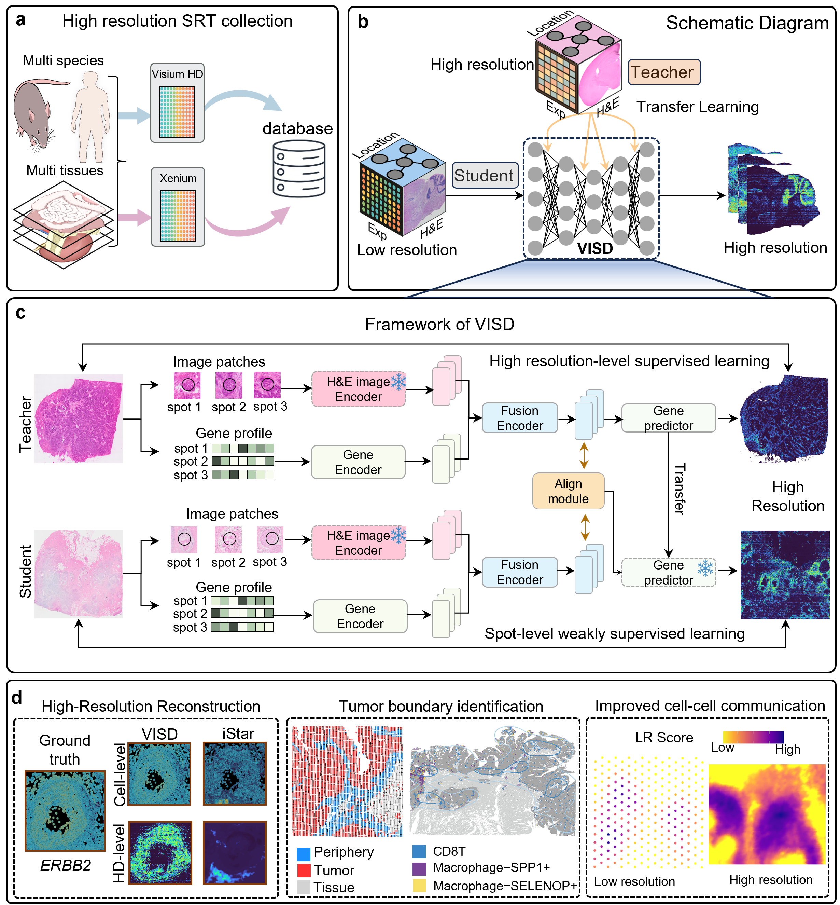

# VISD

VISD: Inferring high-resolution spatial transcriptomics across platforms using cross-sample transfer learning

In this study, we introduce VISD, a deep generative model that enhances the spatial resolution
of Visium data via knowledge transfer from high-resolution spatial transcriptomics platforms.




## Installation

1.  Create an environment from source:

   ```
   conda create -n visd python=3.10 -y
   conda activate visd
   ```

2. Dependency Installation

   ```
   pip install -r requirements.txt
   ```

   

## Data

All the datasets used in VISD can be downloaded from 10x Genomics: https://www.10xgenomics.com/datasets?configure%5BhitsPerPage%5D=50&configure%5BmaxValuesPerFacet%5D=1000&page=2

### Required input format for training data

- `re_image.tif`：Raw histology image
- `pseudo_st.csv`：Gene count matrix。
  - Row 1: Gene names.
  - Row 2 and after: Each row is a spot.
    - Column 1: Spot ID.
    - Column 2 and after: Each column is a gene.
- `pseudo_locs.csv`：Spot locations
  - Row 1: Header
  - Row 2 and after: Each row is a spot. Must match rows in `pseudo_st.csv`
    - Column 1: Spot ID
    - Column 2: x-coordinate (horizontal axis). Must be in the same space as axis-1 (column) of the array indices of pixels in `re_image.tif`.
    - Column 3: y-coordinate (vertical axis). Must be in the same space as axis-0 (row) of the array indices of pixels in `re_image.tif`.
- `mask.png`：Tissue segmentation based on the valid sequencing area.
- `gene_names.txt`: Gene list.
- `pixel-size-raw.txt`：Side length (in micrometers) of pixels in `re_image.tif`.This value is usually between 0.1 and 1.0.
- `radius-raw.txt`：Number of pixels per spot radius in `re_image.tif`.

### Data preprocessing

We provide detailed steps and tutorials for data preprocessing on different data platforms, which you can use directly to process your own data.

- 📘 [Tutorial1-HD processing.ipynb](Tutorial1-HD%20processing.ipynb): Preprocessing steps for Visium HD data.
- 📘 [Tutorial2-Xenium processing.ipynb](Tutorial2-Xenium%20processing.ipynb): Preprocessing steps for Xenium data.
- ✅ For Visium: No special preprocessing is required. You can directly use `pseudo_st.csv` and `pseudo_locs.csv` as the expression matrix and spatial coordinates.


## Demo for VISD training and inferring high resolution gene profile in Mouse Brain datasets

Due to its large size, the demo dataset is hosted on Zenodo: [Download here](https://zenodo.org/records/12800375).  
After downloading, place the files in the `data/` directory of the project.

A full tutorial demonstrating how to train VISD and visualize predicted gene expression is also available:  
📘 [Tutorial3-Demo in MouseBrain.ipynb](Tutorial3-Demo%20in%20MouseBrain.ipynb)

## Baselines

Below are the sources of several representative baseline methods.  
We sincerely thank the authors for generously sharing their work.

- [iStar](https://github.com/daviddaiweizhang/istar): Performs super-resolution gene expression prediction from hierarchical histological features using a feedforward neural network.  
- [XFuse](https://github.com/ludvb/xfuse): Integrates spatial transcriptomics (ST) data and histology images via a deep generative model to infer high-resolution gene expression profiles.  
- [TESLA](https://github.com/jianhuupenn/TESLA): Generates high-resolution gene expression profiles using a Euclidean distance-based metric that captures similarities in physical locations and histological features between superpixels and measured spots.  
- [scstGCN](https://github.com/wenwenmin/scstGCN): Predicts super-resolution gene expression from multimodal feature maps using a weakly supervised graph convolutional network framework.
