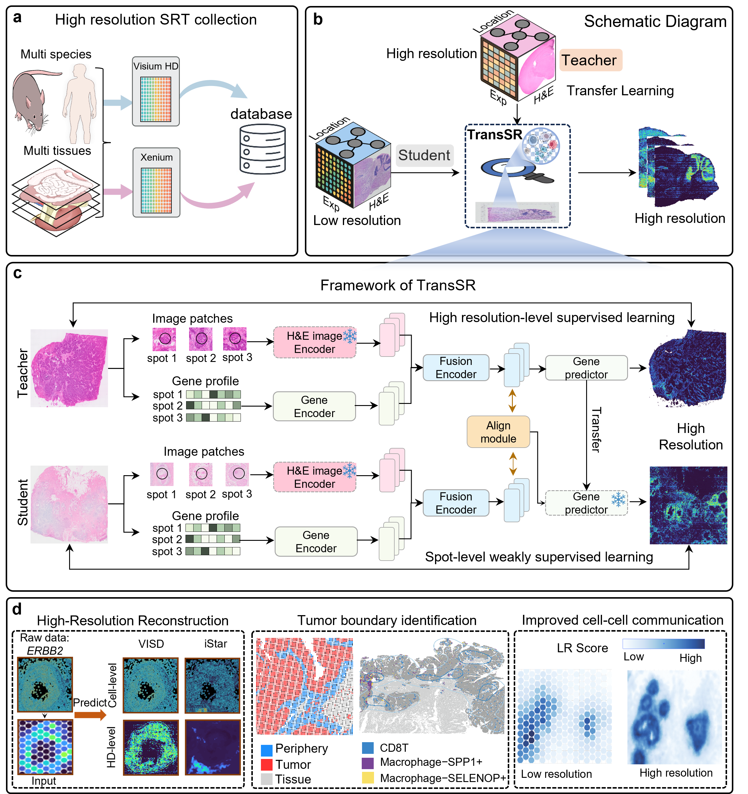

# TransSR

**Generating super-resolution spatial transcriptomics data by transfer learning**

TransSR is a deep generative model designed to enhance the spatial resolution of Visium data by transferring knowledge from high-resolution spatial transcriptomics platforms.



---

## 🔧 Installation

1. **Create a conda environment:**

   ```bash
   conda create -n TransSR python=3.10 -y
   conda activate TransSR
   ```

2. **Install dependencies:**

   ```bash
   pip install -r requirements.txt
   ```

---

## 📁 Data

All datasets used in TransSR can be downloaded from the 10x Genomics data repository:  
🔗 [10x Genomics](https://www.10xgenomics.com/datasets?configure%5BhitsPerPage%5D=50&configure%5BmaxValuesPerFacet%5D=1000&page=2)

For detailed dataset information, please refer to the **Data Availability** section of the paper.

### 📥 Required Input Format for Training

The following files are required as input for training:

- `re_image.tif` — Raw histology image.
- `pseudo_st.csv` — Gene count matrix.
  - Row 1: Gene names.
  - Row 2 onward: One row per spot.
    - Column 1: Spot ID
    - Column 2 and onward: Gene expression values
- `pseudo_locs.csv` — Spot coordinates.
  - Row 1: Header
  - Row 2 onward: One row per spot, matching `pseudo_st.csv`
    - Column 1: Spot ID  
    - Column 2: x-coordinate (horizontal, matches column index of `re_image.tif`)  
    - Column 3: y-coordinate (vertical, matches row index of `re_image.tif`)
- `mask.png` — Tissue segmentation mask indicating valid sequencing area.
- `gene_names.txt` — List of gene names.
- `pixel-size-raw.txt` — Physical pixel size (in micrometers) in `re_image.tif`. Typically between 0.1 and 1.0.
- `radius-raw.txt` — Spot radius in number of pixels in `re_image.tif`.

---

### 🧼 Data Preprocessing

We provide detailed tutorials to help you preprocess datasets from different platforms. These tutorials can also be adapted for your own data.

- 📘 [Tutorial1-HD processing.ipynb](Tutorial1-HD%20processing.ipynb): Preprocessing for Visium HD data  
- 📘 [Tutorial2-Xenium processing.ipynb](Tutorial2-Xenium%20processing.ipynb): Preprocessing for Xenium data  
- ✅ **For Visium:** No special preprocessing is required. You can directly use `pseudo_st.csv` and `pseudo_locs.csv` as the expression matrix and spatial coordinates.

---

## 🚀 Demo: Training TransSR and Predicting High-Resolution Gene Expression (Mouse Brain)

Due to its large size, the demo dataset is hosted on Zenodo:  
📦 [Download from Zenodo](https://zenodo.org/records/15878397)

After downloading, place the files in the project's `data/` directory.

A complete tutorial is available that walks you through training TransSR and visualizing the predicted high-resolution gene expression:

- 📘 [Tutorial3-Demo in MouseBrain.ipynb](Tutorial3-Demo%20in%20MouseBrain.ipynb)

---

## 📊 Baseline Methods

We compare TransSR against several representative baseline methods.  
We sincerely thank the authors for their open-source contributions:

- [**iStar**](https://github.com/daviddaiweizhang/istar): Predicts super-resolution gene expression from hierarchical histological features using a feedforward neural network.  
- [**XFuse**](https://github.com/ludvb/xfuse): Integrates spatial transcriptomics data and histology images using a deep generative model to infer high-resolution gene expression.  
- [**TESLA**](https://github.com/jianhuupenn/TESLA): Generates high-resolution gene expression profiles using a Euclidean distance metric based on spatial and histological similarity between superpixels and measured spots.  
- [**scstGCN**](https://github.com/wenwenmin/scstGCN): Predicts super-resolution gene expression from multimodal feature maps using a weakly supervised graph convolutional network framework.

---

## 📄 License

This project is released under the MIT License. See [LICENSE](LICENSE) for details.

---

## 🙋‍♀️ Contact & Contribution

We welcome questions, feedback, and contributions!  
Feel free to open an [issue](https://github.com/yourusername/TransSR/issues) or submit a pull request.

## 🙏 Acknowledgements

We are inspired by [iStar](https://github.com/daviddaiweizhang/istar), and the Vision Transformer used in our model is pre-trained by [UNI](https://github.com/mahmoodlab/UNI).  
We gratefully acknowledge the authors for their outstanding work.
